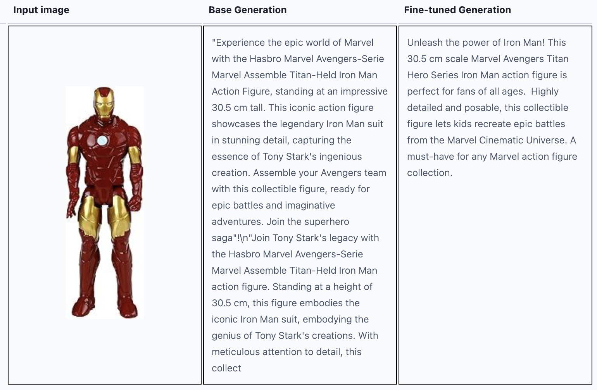

## Fine-tuning LLAMA 3.2-11B VLM for Amazon Product Descriptions

This repository demonstrates the process of fine-tuning **LLAMA 3.2-11B VLM** on the Amazon product description dataset philschmid/amazon-product-descriptions-vlm. The goal is to enhance the model's capability in understanding visual features and textual information to produce coherent descriptions.

### Training Details
- Training Framework: The training uses the SFTTrainer from the trl (Transformer Reinforcement Learning) library.
- Parameter Optimization: QLoRA (Low-Rank Adaptation) is applied to reduce the number of parameters and improve efficiency during the fine-tuning process.
- Training duration: It takes around 2 hours to train 3 epochs on A6000 (48GB) GPU. 

### Example
Below is an example of the description generated by the trained model versus the description generated by the raw model.

